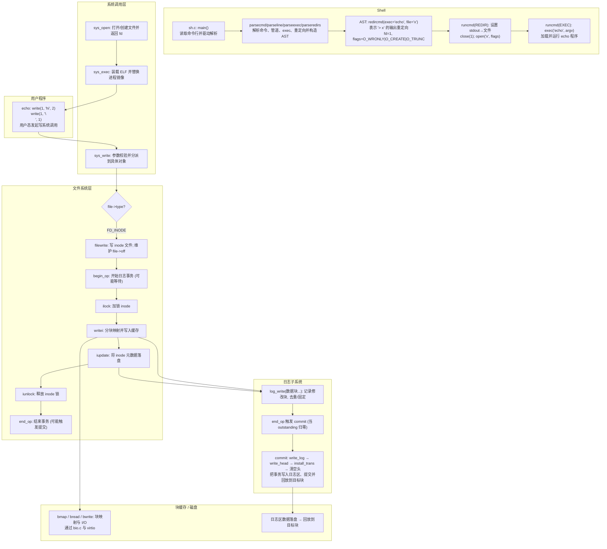

# echo "hi" > x — Mermaid 图

下面给出多张 Mermaid 图，展示 `echo "hi" > x` 在 xv6 中从 Shell 解析、程序执行、系统调用到文件系统与日志提交的完整流程。每张图聚焦一个层面，便于分块理解与对照源码阅读。

## 1. 总览（从 Shell 到磁盘提交）



## 2. Shell 解析与执行（重定向 + exec）

```mermaid
graph TD
  S1[main: getcmd<br/>读取一行命令] --> S2[parsecmd<br/>语法解析入口]
  S2 --> S3[parseline → parseexec → parseredirs<br/>解析管道/exec/重定向]
  S3 --> S4[redircmd(execcmd=echo, file=x, fd=1,\nmode=O_WRONLY|O_CREATE|O_TRUNC)<br/>语法树节点表示 stdout 重定向]
  S4 --> S5[nulterminate: 收尾<br/>为 token 写入'\0']
  S5 --> S6[fork: 创建子进程]
  S6 --> S7[runcmd(REDIR): close(1)<br/>关闭 stdout 以便重定向]
  S7 --> S8[open("x", O_WRONLY|O_CREATE|O_TRUNC)<br/>创建/截断并打开文件]
  S8 --> S9[runcmd(EXEC): exec("echo", argv)<br/>用 echo 替换进程镜像]
```

## 3. write() 写路径（sys_write → filewrite → writei）

```mermaid
graph TD
  W0[echo 用户态: write(fd=1, buf, n)<br/>发起写系统调用] --> W1[sys_write: 校验并分派]
  W1 --> W2[argfd: 将 fd 解析为 struct file* 并检查可写]
  W2 --> W3{file->type}
  W3 -- FD_PIPE --> WP[pipewrite: 向管道写数据并唤醒读者]
  W3 -- FD_DEVICE --> WD[devsw[major].write: 设备驱动写]
  W3 -- FD_INODE --> W4[filewrite: 写普通文件; 维护 file->off]
  W4 --> W5[begin_op: 开始日志事务]
  W5 --> W6[ilock: 锁住 inode]
  W6 --> W7[writei: 按块写入数据]
  W7 --> W8[iupdate: 刷新 inode 元数据]
  W8 --> W9[iunlock: 释放 inode 锁]
  W9 --> W10[end_op: 结束事务]
```

## 4. writei 细节（分块映射与日志记录）

```mermaid
graph TD
  I0[writei(ip, src, off, n)<br/>核心落盘路径] --> I1[参数校验与截断]
  I1 --> I2{还有待写字节?}
  I2 -- 是 --> I3[bmap(ip, LBA): 逻辑→物理块映射; 需时分配]
  I3 --> I4[bread(dev, blkno): 读入缓存 buf]
  I4 --> I5[either_copyin: 从用户态拷入缓冲]
  I5 --> I6[log_write(buf): 记录缓冲修改]
  I6 --> I7[brelse: 释放缓存引用]
  I7 --> I2
  I2 -- 否 --> I8[若扩大文件: 更新 ip->size]
  I8 --> I9[iupdate: 记录 inode 变化]
```

## 5. 日志事务与提交（begin_op → end_op/commit）

```mermaid
graph TD
  L1[begin_op: 进入事务区间] --> L2[获取 log.lock]
  L2 --> L3{空间/提交是否可用?}
  L3 -- 等待 --> L2
  L3 -- 通过 --> L4[log.outstanding++ 释放锁]

  subgraph 事务中
    L4 --> L5[log_write(buf): 去重并记录块号\n必要时 bpin 固定缓存]
  end

  L5 --> L6[end_op: 离开事务区间]
  L6 --> L7[获取 log.lock; log.outstanding--]
  L7 --> L8{归零?}
  L8 -- 否 --> L9[释放锁 返回]
  L8 -- 是 --> L10[设 committing=1; 释放锁]

  L10 --> LC[commit: 执行提交]
  LC --> C1{log.lh.n > 0?}
  C1 -- 否 --> C6[清空/写回头部(空) 结束]
  C1 -- 是 --> C2[write_log: 将缓存数据块\n顺序写入日志区域]
  C2 --> C3[write_head: 写日志头 = 提交]
  C3 --> C4[install_trans: 回放到目标块]
  C4 --> C5[清空 log.lh 并再次 write_head(清零)]
```

## 6. 文件创建（open O_CREATE → create）

```mermaid
graph TD
  O1[sys_open("x", O_CREATE|O_TRUNC|O_WRONLY)<br/>解析 flags 并打开/创建] --> O2{O_CREATE?}
  O2 -- 是 --> O3[create(path, T_FILE, ...)<br/>新建或复用文件 inode]
  O2 -- 否 --> O7[namei 查找既有 inode<br/>若带 O_TRUNC: itrunc 清空内容]

  O3 --> O4[nameiparent: 找父目录 + 末级名]
  O4 --> O5{已存在同名?}
  O5 -- 是(文件) --> O6[复用 inode]
  O5 -- 否 --> O8[ialloc: 分配 inode, 清零并 iupdate]
  O8 --> O9[若目录: 建立 . 与 ..]
  O9 --> O10[dirlink: 在父目录添加目录项]
  O6 --> O11[filealloc/fdalloc: 建立 struct file 并分配 fd]
  O10 --> O11
```

—

使用方式：建议配合 `docs/echo执行流程.md` 的函数定位一起阅读，先看第 1 张“总览图”把握主线，再按需展开第 3～6 张图以理解关键路径（写入流程、日志、创建与块映射）。
