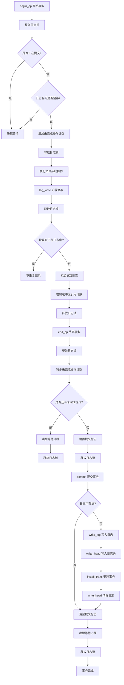
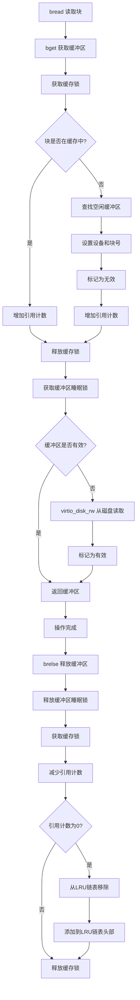
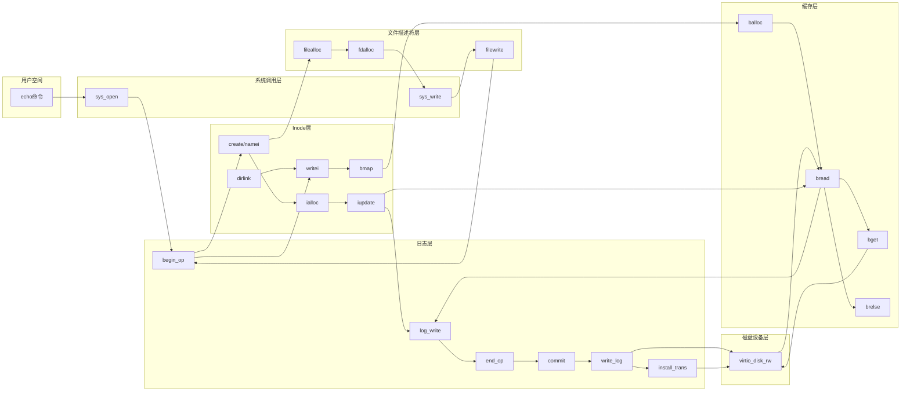
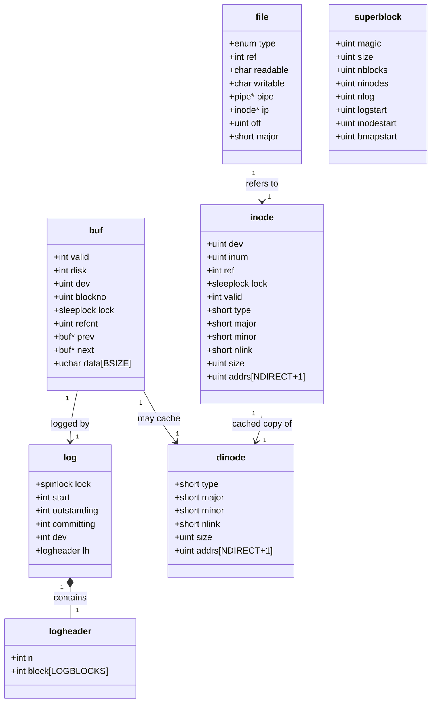

# xv6 文件系统中 `echo "hi" > x` 命令的数据流和日志提交过程流程图

## 系统调用流程图

```mermaid
graph TD
    A[用户空间: echo "hi" > x] --> B[系统调用层: sys_open]
    B --> C[sys_open: begin_op 开始事务]
    C --> D{文件 x 是否存在?}
    D -->|否| E[create 创建文件]
    D -->|是| F[namei 查找文件]
    E --> G[ialloc 分配 inode]
    G --> H[iupdate 更新 inode 到磁盘]
    H --> I[dirlink 在目录中添加条目]
    I --> J[filealloc 分配文件结构体]
    F --> J
    J --> K[fdalloc 分配文件描述符]
    K --> L[sys_open: end_op 结束事务]
    L --> M[系统调用层: sys_write]
    M --> N[filewrite 文件写入]
    N --> O[begin_op 开始事务]
    O --> P[ilock 锁定 inode]
    P --> Q[writei 写入数据到 inode]
    Q --> R[bmap 获取块映射]
    R --> S{需要新块?}
    S -->|是| T[balloc 分配磁盘块]
    S -->|否| U[bread 读取磁盘块到缓存]
    T --> U
    U --> V[either_copyin 复制数据到缓存]
    V --> W[log_write 记录块到日志]
    W --> X[iupdate 更新 inode 元数据]
    X --> Y[iunlock 解锁 inode]
    Y --> Z[end_op 结束事务]
    Z --> AA{是否有未完成操作?}
    AA -->|否| BB[commit 提交事务]
    AA -->|是| CC[等待其他操作完成]
    CC --> Z
    BB --> DD[write_log 将修改的块写入日志]
    DD --> EE[write_head 写入日志头 提交点]
    EE --> FF[install_trans 将日志块安装到目标位置]
    FF --> GG[write_head 清除日志]
    GG --> HH[操作完成]
```

## 日志系统详细流程图



## 缓存系统流程图



## 完整数据流图



## 关键数据结构关系图



这些流程图展示了 `echo "hi" > x` 命令在 xv6 文件系统中的完整执行过程，包括系统调用、文件操作、日志记录、缓存管理和磁盘I/O等各个阶段的详细流程。